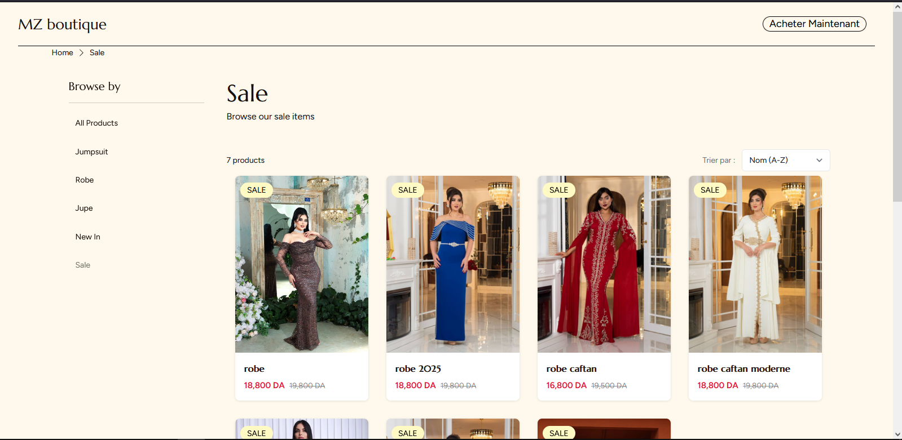
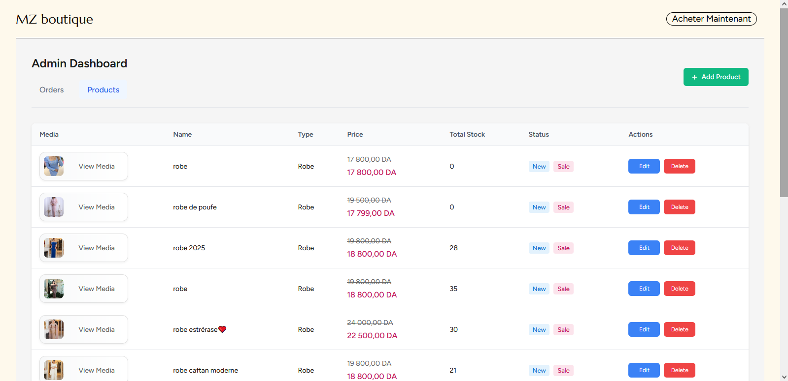
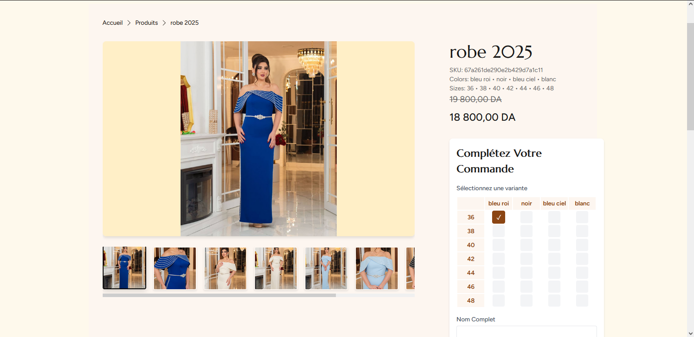

# E-commerce Store

A modern, full-stack e-commerce platform built with React, Remix, TypeScript, and Node.js.

## 🌟 Features

- **Modern Tech Stack**: Built with React, Remix, TypeScript, and Vite
- **Responsive Design**: Beautiful UI with Material-UI and Blueprint.js
- **Data Visualization**: Rich charts and graphs using Nivo
- **Advanced UI Components**: 
  - Interactive product filtering
  - Dynamic search
  - Shopping cart management
  - User authentication
  - Admin dashboard
- **Performance Optimized**: Fast page loads and optimized bundle sizes

<div style="display: grid; grid-template-columns: repeat(3, 1fr); gap: 10px;">
  
  
  
  
</div>

## 🚀 Getting Started

### Prerequisites

- Node.js >= 18.0.0
- npm (comes with Node.js)

### Installation

1. Clone the repository:
```bash
git clone https://github.com/malek4522/E-commerce-store.git
cd E-commerce-store
```

2. Install frontend dependencies:
```bash
cd frontend
npm install
```

3. Set up environment variables:
```bash
cp .env.example .env
# Edit .env with your configuration
```

4. Start the development server:
```bash
npm run dev
```

The application will be available at `http://localhost:5173`

### Production Build

```bash
npm run build:prod
npm run start:prod
```

## 🛠️ Tech Stack

### Frontend
- **Framework**: React with Remix
- **Build Tool**: Vite
- **Language**: TypeScript
- **UI Libraries**: 
  - Material-UI
  - Blueprint.js
  - Radix UI
- **Styling**: SCSS
- **Data Visualization**: Nivo
- **State Management**: SWR
- **Form Handling**: React Hook Form

### Development Tools
- ESLint for code linting
- Prettier for code formatting
- TypeScript for type safety

## 📁 Project Structure

```
frontend/
├── app/              # Remix application routes and components
├── src/              # Source files
│   ├── components/   # Reusable React components
│   ├── hooks/        # Custom React hooks
│   └── utils/        # Utility functions
├── public/           # Static files
└── build/            # Production build output
```

## 🔧 Available Scripts

- `npm run dev` - Start development server
- `npm run build` - Create production build
- `npm run start` - Start production server
- `npm run lint` - Run ESLint
- `npm run typecheck` - Run TypeScript type checking
- `npm run prettier:check` - Check code formatting
- `npm run build:prod` - Create production build with type checking and linting
- `npm run clean` - Clean build artifacts

## 🚀 Deployment

This project is configured for deployment on Render.com:

1. Connect your GitHub repository to Render
2. Create a new Web Service
3. Use the following settings:
   - Build Command: `npm run build`
   - Start Command: `npm run start`
   - Publish Directory: `build/client`

## 📝 License

This project is licensed under the MIT License - see the [LICENSE](LICENSE) file for details.

## 🤝 Contributing

Contributions are welcome! Please feel free to submit a Pull Request.

1. Fork the project
2. Create your feature branch (`git checkout -b feature/AmazingFeature`)
3. Commit your changes (`git commit -m 'Add some AmazingFeature'`)
4. Push to the branch (`git push origin feature/AmazingFeature`)
5. Open a Pull Request
